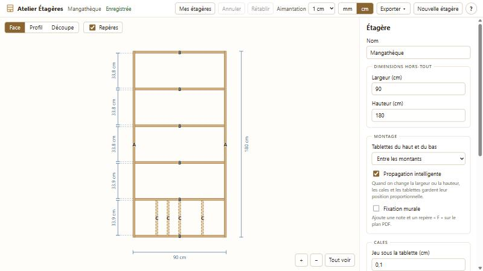
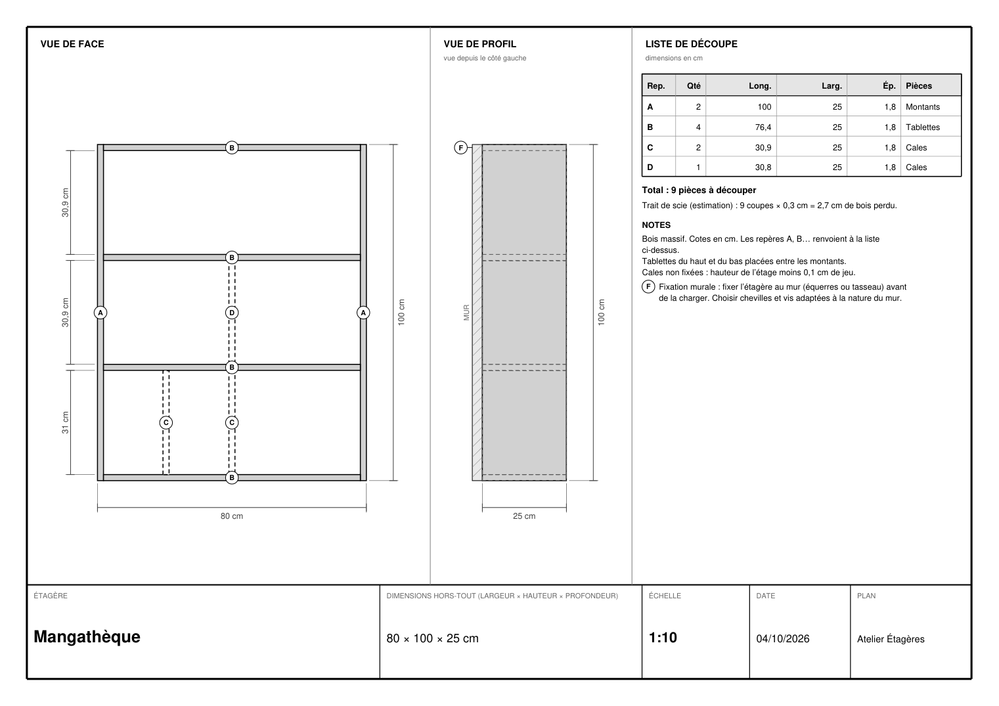

# Atelier Étagères

Concevez vos étagères en bois massif dans le navigateur : dessinez-les, ajustez leurs dimensions à la souris ou au clavier, puis obtenez la **liste des planches à faire découper** et un **plan PDF** à emporter en magasin.

**Essayer en ligne : <https://alticoco.github.io/atelier-etageres/>**



## Ce que fait l'application

- **Assistant de création** : largeur, hauteur, profondeur, nombre d'étages, épaisseurs du bois. Aperçu en direct pendant la saisie.
- **Deux modèles de construction** : **avec cadre** (deux montants pleine hauteur, tablettes entre eux) ou **sans cadre** (planches apparentes : tablettes continues avec un débord réglable à gauche et à droite, montants coupés à la hauteur de chaque étage et supprimables un par un).
- **Vue de face** cotée et **vue de profil** (lecture seule), avec zoom et déplacement.
- **Édition à la souris** : déplacer les tablettes et les cales, redimensionner le cadre par ses bords, avec aimantation à un pas réglable (1 mm, 5 mm, 1 cm, 5 cm ; `Alt` pour s'en passer).
- **Édition au clavier** : saisie de toute cote dans un panneau, flèches pour déplacer une pièce, sélection multiple pour appliquer une même épaisseur à plusieurs pièces.
- **Propagation « intelligente »** : changer la largeur ou la hauteur garde les cales et les tablettes à leur position proportionnelle (désactivable).
- **Contrôles de cohérence** : pas de chevauchement, pas de cale plus haute que son étage, des messages clairs quand une modification est refusée.
- **Arrondis** : deux rayons par pièce, un pour les coins (vue de face) et un pour les arêtes (vue de profil), limités à la moitié de la plus petite dimension visible. Dessinés sur le plan et sur le PDF, et indiqués dans la liste de découpe.
- **Annuler / rétablir** (`Ctrl+Z`, `Ctrl+Y`), sans limite pendant la session.
- **Liste de découpe** : pièces regroupées par dimensions identiques, avec quantités et repères A, B, C… reportés sur le plan ; option « trait de scie » pour estimer la perte de bois.
- **Plan PDF** en A4 paysage, dessin vectoriel : vue de face et de profil cotées, liste de découpe, notes, cartouche. Option « fixation murale ».
- **Sauvegarde** automatique dans le navigateur (bibliothèque d'étagères : ouvrir, renommer, dupliquer, supprimer), export et import d'un fichier `.etagere.json`.
- **Un PDF exporté peut être ré-importé** : le plan éditable est joint au PDF.
- Unités au choix : millimètres ou centimètres.

Les raccourcis clavier sont listés dans l'application (touche `?`).

### Exemple de plan PDF



## Vos données restent chez vous

Aucune donnée n'est envoyée nulle part : pas de serveur, pas de compte, pas de statistiques. Les étagères sont enregistrées dans le stockage du navigateur (IndexedDB), propre à chaque navigateur et à chaque adresse. Pour les garder ou les changer d'ordinateur, utilisez **Exporter** (fichier `.etagere.json` ou PDF).

> Si vous videz les données du site dans votre navigateur, les étagères enregistrées disparaissent : exportez de temps en temps un fichier de secours.

## Lancer le projet en local

Il faut [Node.js](https://nodejs.org/) (version 20.19 ou plus récente ; le projet est développé avec Node 24).

```bash
npm install
npm run dev      # serveur local, avec rechargement automatique
```

| Commande | Rôle |
|---|---|
| `npm run dev` | Serveur local de développement |
| `npm test` | Lance tous les tests (Vitest) |
| `npm run lint` | Vérifie le code (oxlint) |
| `npm run build` | Construit le site dans `dist/` |
| `npm run preview` | Sert le site construit |

Le site est déployé automatiquement sur GitHub Pages à chaque envoi sur `main` (GitHub Actions : lint, tests et build doivent passer).

## Comment c'est construit

Vite + React + TypeScript (mode strict), tests avec Vitest. Choix techniques principaux :

- **Millimètres entiers partout** dans le modèle : pas d'erreur d'arrondi. Les centimètres ne sont qu'un affichage.
- **Logique métier séparée de l'affichage.** Toute la géométrie, les règles d'assemblage, la liste de découpe, la mise en page du PDF vivent dans des fonctions pures testées, sans React.
- **Les longueurs sont calculées, jamais stockées** (une tablette = largeur − montants, une cale = hauteur de l'étage − jeu) : le plan ne peut pas se contredire.
- **Un seul état global** modifié par des actions nommées, ce qui donne l'historique annuler / rétablir presque gratuitement.
- **Dessin 2D en SVG** ; PDF en dessin vectoriel avec [pdf-lib](https://pdf-lib.js.org/), chargé seulement quand on exporte ou importe un PDF.
- **Tout ce qui vient de l'extérieur est validé** (fichier importé, PDF, base du navigateur) avant d'être utilisé.

```text
src/
  model/      règles métier en fonctions pures : plan, tablettes, cales, liste de découpe, propagation, édition…
  store/      état de l'éditeur (actions nommées, historique)
  views/      composants React : vue de face, profil, panneau, assistant, bibliothèque…
  pdf/        mise en page du plan PDF (pure) et génération / lecture du fichier
  storage/    bibliothèque dans le navigateur (IndexedDB), export / import
  keyboard.ts raccourcis clavier
docs/         spécification, feuille de route, journal des décisions
```

## Documentation du projet

- [`docs/SPEC.md`](docs/SPEC.md) : ce que fait l'application (source de vérité fonctionnelle).
- [`docs/ROADMAP.md`](docs/ROADMAP.md) : où on en est, critères de « terminé », idées pour plus tard.
- [`docs/DECISIONS.md`](docs/DECISIONS.md) : chaque choix technique et la raison.

## Limites connues

- Pensé pour **un ordinateur** (écran d'au moins 1280 px de large) ; pas de version téléphone pour l'instant.
- Testé surtout avec un navigateur de la famille Chrome ; conçu pour Chrome, Edge et Firefox récents.
- La liste de découpe regroupe les pièces mais **n'optimise pas** la découpe dans les planches : on choisit soi-même les planches en magasin.
- Le modèle de construction (avec ou sans cadre) se choisit à la création et ne se change pas ensuite. La vue de profil éditable, les onglets, la vue 3D, les portes et les tiroirs sont prévus plus tard (voir la feuille de route).

## Licence

[MIT](LICENSE) © 2026 Alticoco : vous pouvez utiliser, copier, modifier et redistribuer ce code, y compris dans un projet commercial, à condition de conserver la mention de copyright.
